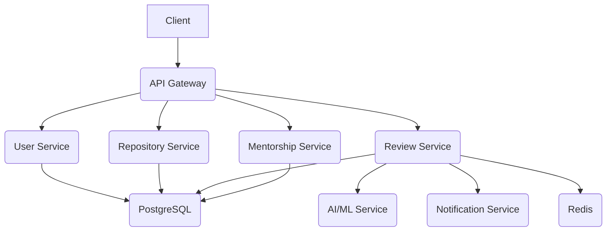

# CodeGuardian: Application Architecture & Technical Specifications

## 1. System Architecture

CodeGuardian will be built on a modern, scalable, and secure microservices architecture. This architecture will enable independent development, deployment, and scaling of each service, ensuring high availability and resilience. The system will be composed of several core services, each responsible for a specific set of functionalities.

### 1.1. Core Services

- **API Gateway**: The single entry point for all client requests. It will handle authentication, rate limiting, and routing of requests to the appropriate microservices.
- **User Service**: Responsible for user authentication, authorization, and management.
- **Repository Service**: Manages the integration with version control systems (GitHub, GitLab, etc.) and handles repository-related operations.
- **Review Service**: The core service responsible for orchestrating the code review process. It will interact with the AI/ML service to get code analysis results and post them as comments on pull requests.
- **AI/ML Service**: A dedicated service for running the AI/ML models. It will expose a simple API for the Review Service to get code analysis results.
- **Mentorship Service**: Manages the personalized learning paths and skill gap analysis for developers.
- **Notification Service**: Responsible for sending notifications to users via email, Slack, etc.

### 1.2. Data Stores

- **PostgreSQL**: The primary database for storing user data, repository information, and review history.
- **Redis**: Used for caching frequently accessed data and as a message broker for asynchronous communication between services.

### 1.3. High-Level Architecture Diagram

## 2. Frontend Architecture

The frontend will be a single-page application (SPA) built with React, TypeScript, and Next.js. It will be designed to be fast, responsive, and user-friendly.

### 2.1. Key Features

- **Component-Based Architecture**: The UI will be built using a component-based architecture, with each component being responsible for a specific part of the UI.
- **State Management**: Redux Toolkit will be used for state management, providing a centralized store for the application state.
- **Routing**: Next.js Router will be used for routing, enabling client-side navigation and server-side rendering (SSR).
- **Styling**: Tailwind CSS will be used for styling, providing a utility-first CSS framework for building custom designs.
- **Real-Time Updates**: WebSockets will be used for real-time updates, enabling features like live code review sessions.

## 3. Backend Architecture

The backend will be built with Node.js, TypeScript, and NestJS. It will be designed to be scalable, resilient, and secure.

### 3.1. Key Features

- **Microservices Architecture**: The backend will be built using a microservices architecture, with each service being responsible for a specific set of functionalities.
- **GraphQL API**: The backend will expose a GraphQL API, providing a flexible and efficient way for the frontend to query data.
- **Authentication & Authorization**: JWT (JSON Web Tokens) will be used for authentication, and a role-based access control (RBAC) system will be implemented for authorization.
- **Database**: PostgreSQL will be used as the primary database, and TypeORM will be used as the ORM for interacting with the database.
- **Caching**: Redis will be used for caching frequently accessed data, improving the performance of the application.

## 4. CI/CD Pipeline

A CI/CD pipeline will be set up to automate the build, testing, and deployment of the application.

### 4.1. Key Stages

- **Build**: The code will be built and containerized using Docker.
- **Test**: Unit tests, integration tests, and end-to-end tests will be run to ensure the quality of the code.
- **Deploy**: The application will be deployed to a Kubernetes cluster in the cloud.
- **Monitor**: The application will be monitored using Prometheus and Grafana to ensure its health and performance.

